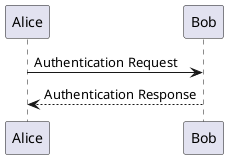

#### This is a markdown doc

### Higher title

## Even bigger title

# Largest Title

*This is italic*

**This is bold**

***This is bold and italic***

- This is a list
  - This is a sublist
    - This is a subsublist
- This is another list
- This is the last list

1. This is a numbered list
2. This is another numbered list
3. This is the last numbered list

---

This is a horizontal rule

---

This is a blockquote:

> This is a blockquote
> This is another line in the blockquote
> This is the last line in the blockquote


This is a code block:

```python
def hello_world():
    print("Hello, World!")
```

This is a link: [Google](https://www.google.com)

This is an image: 

This is a table

| Name | Age |
|------|-----|
| John | 25  |
| Jane | 23  |
| Jack | 30  |

This is a task list:

- [x] Task 1
- [ ] Task 2
- [ ] Task 3
- [x] Task 4
- [ ] Task 5

This is a definition list:

Term 1
: Definition 1

Term 2
: Definition 2

Term 3
: Definition 3


This is a footnote[^1]

[^1]: This is the footnote


This is a superscript: 2^10^

This is a subscript: H~2~O

This is a strike-through: ~~This is a strike-through~~

This is a math block:

$$
\frac{1}{2}
$$

This is a flowchart:

```flow
st=>start: Start
op=>operation: Your Operation
cond=>condition: Yes or No?
e=>end

st->op->cond
cond(yes)->e
cond(no)->op
```


This is a sequence diagram:

```sequence
Alice->Bob: Hello Bob, how are you?
Note right of Bob: Bob thinks
Bob-->Alice: I am good, thank you!
```


This is a mermaid diagram:


This is a gantt chart:

```gantt
    title A Gantt Diagram
    dateFormat  YYYY-MM-DD
    section Section
    A task           :a1, 2020-01-01, 30d
    Another task     :after a1  , 20d
    section Another
    Task in sec      :2020-02-12  , 12d
    another task     : 24d
```


This is a plantuml diagram:


